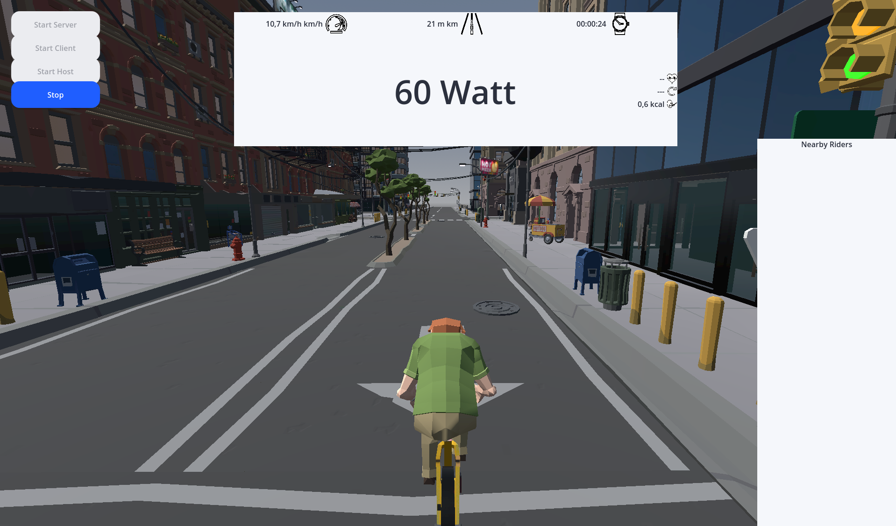

# LanboostVirtualBike

A Open source version of most virtual bike simulators. Example Zwift, MyWhoosh. Made in Godot for Android (no BLE support for PC)

## Assets

Quite a few assets are bought from SyntyStudios and can therefore not be redistributed as FOSS.

If you compile the project on your own you therefore need to supply your own assets.

## Features

- Network
- BLE power trainer support

### Todos

- Traininer Program Support
- Support for better multiplayer
- Better error handling
- Heartrate and cadance sensors
- More and interesting routes / maps

